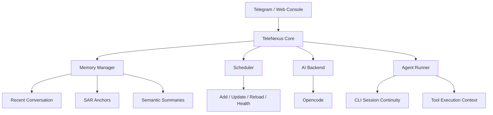

<p align="center">
  
</p>

<p align="center">
  <strong>Local AI Control Plane for Telegram, CLI, Memory, and Scheduling</strong>
</p>

<p align="center">
  
  
  
  
</p>

# TeleNexus

> 您的私人本地 AI 助理閘道器（Telegram -> Local CLI Agent）

TeleNexus 讓您用 Telegram 控制本機 AI CLI（Opencode），並提供排程、記憶、觀測與 runner 架構。

它不是單純把 Telegram 接到模型，而是把「本地 CLI 能力、長對話記憶、排程、自動化治理、可觀測性」整合成一個可長期運作的個人 AI 控制平面。

---

## 快速導覽

- `想快速跑起來`：看 `TL;DR（5 分鐘上手）`
- `想先懂這專案強在哪`：看 `核心優點` 與 `和一般 AI Bot 差在哪`
- `想看深入文件`：看 `docs/README.md`

---

## 一句話定位

TeleNexus 適合想要把 AI 當成「長期可治理的本地代理人」而不是一次性聊天視窗的人。

> 如果你要的是：
>
> - 用 Telegram / Web 直接調度本機 CLI Agent
> - 讓 AI 記得你的發版規則、故障處置與操作慣例
> - 把排程、記憶、觀測、發版 SOP 放進同一套系統
>
> 那 TeleNexus 就是在做這件事。

---

## 這工具幫你解決什麼

- 不想每次都手動進機器操作 CLI，就用 Telegram 或 Web 直接驅動它
- 不想每隔幾天重新教 AI 一次你的規則，就把重要做法留在長期記憶裡
- 不想把排程、除錯、觀測、發版拆成很多零散工具，就交給同一套控制平面

---

## 核心優點

### 1) 真正可用的本地 AI 閘道

- 用 Telegram 就能直接驅動本機 CLI Agent，不需要另外維護一套雲端中介層。
- 保留 CLI workflow 的靈活性，同時補上 bot / web / scheduler / runner 的整合能力。

### 2) 長對話不容易失憶

- 內建 `Summary-Aware Retrieval (SAR)`，不是只抓最近幾筆訊息。
- 會把近期對話、核心決策回顧、相關歷史摘要一起整理進 prompt。
- 對 `release`、`opencode`、`scheduler`、`web chat history` 這類已治理過的規則，命中穩定性更高。

### 3) 記憶治理不是黑盒

- 支援記憶標記、核心規則保留與 metadata backfill。
- 可用 `memory-cli` 人工檢視與補標高價值記憶，不必完全依賴模型自動摘要。
- SAR retrieval 已有最小 regression 護欄，後續調整較不容易默默退化。

### 4) Runner 與 session 脈絡更穩

- 預設聊天流量走 `agent-runner`，降低直接進容器操作造成的上下文分裂。
- 支援接續 session、強制新 session、CLI passthrough 指令與背景 Memoria 同步。

### 5) 排程、觀測、除錯都內建

- 內建 scheduler CLI、reload、health check。
- `workspace/context/` 會持續寫出 runtime/provider/scheduler/error/runner 快照。
- 發生問題時，比較容易知道是 provider、runner、session、scheduler 還是 prompt 層出了偏差。

## 適合什麼場景

- 想用 Telegram 或 Web Console 遠端驅動自己機器上的 AI CLI
- 想把常做的研究、維運、發版、排程工作交給同一套 AI 工作流
- 想保留本地執行與工具權限，但又不想失去 session、記憶與觀測能力

---

## 系統大致怎麼運作

這一段只提供快速全貌；如果你想看更完整的設計、維護規則或歷史脈絡，請直接進 `docs/README.md`。

### 互動層

- Telegram Bot：最直接的日常控制入口
- Web Console：可視化查看對話與操作狀態
- CLI Session：可直接進 runner 接續既有 session 除錯

### 執行層

- `telenexus`：主協調服務，負責對話、記憶、排程、觀測
- `agent-runner`：承接 CLI 執行脈絡，降低 session 斷裂
- AI 後端：以 Opencode CLI 作為唯一執行後端

### 記憶層

- recent conversation：保留當前對話連續性
- 核心規則記憶：優先保留高價值決策與固定做法
- 相關歷史摘要：補回和當前問題有關的舊脈絡
- 記憶標記與整理：用 `summary / impact_level / tags` 管理長期記憶

### 治理層

- scheduler CLI / reload / health
- release SOP / tag / migration log
- runtime snapshots / error summary / provider 狀態

---

## Architecture At A Glance



- `TeleNexus Core` 負責收訊、組 prompt、注入記憶、分派執行與寫入觀測。
- `Memory Manager` 負責 recent context、長對話記憶檢索與記憶整理。
- `Agent Runner` 把 CLI session 從 bot 容器中抽離，降低上下文斷裂與除錯混亂。
- `Scheduler` 讓定時工作和一般聊天走同一套治理與可觀測模型。

---

## 和一般 AI Bot 差在哪

| 能力          | 一般聊天 Bot         | TeleNexus                                 |
| ------------- | -------------------- | ----------------------------------------- |
| 本地 CLI 執行 | 通常沒有             | 內建，且可接 runner session               |
| 長期記憶      | 多半只有近期訊息     | 有長對話記憶檢索、核心規則保留、記憶標記  |
| 可回溯治理    | 多靠人工整理         | 有 migration log、release SOP、tag        |
| 排程整合      | 常需外掛另一套系統   | 內建 scheduler CLI / reload / health      |
| 可觀測性      | 常只剩 container log | 有 runtime/provider/scheduler/runner 快照 |
| 可維護性      | 常靠人工記憶         | 有 release SOP、tag、migration log        |

---

## 補充說明

- 一般 bot 比較像訊息轉發器；TeleNexus 更像本地 AI 控制平面
- 如果你想看更完整的記憶、排程、runner、release 設計，請直接進 `docs/README.md`

---

## TL;DR（5 分鐘上手）

### 1) 準備環境變數

- 複製 `.env.example`（開發）或 `.env.production.example`（保守上線）
- 最低必要：

```env
TELEGRAM_TOKEN=your_bot_token
ALLOWED_USER_ID=your_telegram_user_id
DB_DIR=./data
```

### 2) 啟動雙服務

```bash
docker compose up -d --build
```

### 3) 確認服務狀態

```bash
docker compose ps
docker compose logs -f telenexus
```

### 4) 打開 Web Console（預設啟用）

- `http://127.0.0.1:3030`

---

## 你會得到什麼

- 單人白名單模型（`ALLOWED_USER_ID`）
- Opencode CLI 後端（`ai-config.yaml` 控制基礎設定；可透過 `/set_model` 即時切換模型，不需重啟）
- 排程系統（新增、刪除、重載、健康檢查）
- 雙服務標準架構（`telenexus` + `agent-runner`）
- `Summary-Aware Retrieval (SAR)` 記憶檢索與 canonical anchors
- `summary / impact_level / tags` 記憶治理欄位與 backfill 工具
- `workspace/context/` 觀測快照（runtime/provider/scheduler/error/runner）
- 內建常用基礎工具（`git`、`unzip`）減少臨時繞道

---

## 最常用操作

### 排程（Docker 內）

```bash
docker compose exec telenexus node /app/dist/tools/scheduler-cli.js list
docker compose exec telenexus node /app/dist/tools/scheduler-cli.js add "每小時報告" "0 * * * *" "請提供簡單市場分析"
docker compose exec telenexus node /app/dist/tools/scheduler-cli.js reload
docker compose exec telenexus node /app/dist/tools/scheduler-cli.js health
```

### 模型管理（Telegram 指令）

| 指令 | 說明 |
|------|------|
| `/model` | 顯示目前生效的模型及來源（override / base config） |
| `/models` | 列出所有可用模型 |
| `/models opencode` | 篩選特定 provider（如 `opencode`、`nvidia`） |
| `/set_model <model-id>` | 切換模型，下一則訊息立即生效 |
| `/reset_model` | 清除 override，恢復 `ai-config.yaml` 的基礎設定 |

模型 override 寫入 `data/ai-config.override.yaml`，`ai-config.yaml` 本身維持唯讀不變動。

### Runner 健康檢查

```bash
docker compose exec telenexus node -e "fetch('http://agent-runner:8787/health').then(r=>r.json()).then(console.log)"
```

---

## Session 與 Context（重點）

- 預設聊天流量走 `agent-runner`（`CHAT_USE_RUNNER_PERCENT=100`）
- 一般情況不需手動進容器，系統會自動接續 session
- 若要人工除錯並接續同一條 CLI context，請優先進 `agent-runner`

```bash
# Opencode（接續 session）
docker compose exec agent-runner sh -lc "cd /app/workspace && opencode run -c"
```

補充：

- `/new` 會讓下一則一般對話訊息強制使用新 session（不接續）
- `/send_file 路徑 | 說明` 可把專案目錄內檔案回傳到 Telegram（例如 `/send_file workspace/context/runner-status.md | 最新 runner 狀態`）
- 也可在一般對話要求 AI 直接回傳檔案；AI 會透過 `[[SEND_FILE: workspace/temp/檔名 | 說明]]` 協議觸發附件傳送（自動模式僅允許 `workspace/temp/`）
- 一般對話的記憶檢索由 TeleNexus 在分派前統一注入，與 provider hook 解耦
- passthrough 指令（如 `/compress`）仍維持直通 CLI，不額外包裝 TeleNexus 一般 prompt
- 預設啟用 Memoria 自動同步（auto 模式）：每次成功對話會背景呼叫 `workspace/Memoria/cli sync`
- 在 `telenexus` 容器手動跑 CLI，可能與 runner 的實際執行脈絡不同

Memoria 同步可用環境變數調整：

- `MEMORIA_SYNC_ENABLED=auto|on|off`（預設 `auto`）
- `MEMORIA_HOME`（預設 `/app/workspace/Memoria`）
- `MEMORIA_CLI_PATH`（預設 `$MEMORIA_HOME/cli`）
- `MEMORIA_SYNC_TIMEOUT_MS`（預設 `20000`）
- `MEMORIA_HOOK_QUEUE_ENABLED`（預設 `false`，hook-free 模式）
- `SEND_FILE_STRICT_TEMP_ONLY=true|false`（預設 `false`；設為 `true` 時連 `/send_file` 也僅允許 `workspace/temp/`）
- `MEMORIA_HOOK_QUEUE_FILE`（僅在啟用 hook queue 時使用）
- `MEMORIA_HOOK_FLUSH_SIGNAL`（僅在啟用 hook queue 時使用）
- `MEMORIA_HOOK_QUEUE_POLL_MS`（僅在啟用 hook queue 時使用）
- `TELEGRAM_LAUNCH_RETRY_BASE_MS` / `TELEGRAM_LAUNCH_RETRY_MAX_MS`（Telegram 啟動重試參數）
- `OPENCODE_VERBOSE_STDERR=true`（需要完整 stderr 除錯時再開）

---

## 文件導覽

- 文件入口：`docs/README.md`
- Web Console 詳細說明：`docs/web-console-reference.md`
- 環境變數與 Runner 設定：`docs/configuration-reference.md`
- 排程 runbook：`docs/scheduler-operation-runbook.md`
- 長對話記憶設計：`docs/summary-aware-retrieval-plan.md`
- 邊界與安全：`docs/runtime-boundary-and-security.md`
- 部署 checklist：`docs/deployment-cutover-checklist.md`
- 遷移紀錄：`docs/migration-log.md`

---

## 本機開發

```bash
npm run dev
npm run dev:runner
npm run build
npm run lint
```

---

## 免責聲明

本專案支援高權限 Agent 操作流程。請務必妥善保護：

- `TELEGRAM_TOKEN`
- `RUNNER_SHARED_SECRET`
- `ALLOWED_USER_ID`
