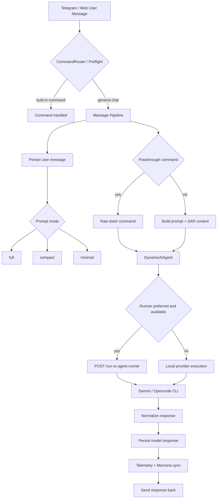

# TeleNexus 流程演進

本文件保留「早期流程」與「目前流程」的差異，但不再把舊流程描述成現況。

## 目前流程

## 早期流程和現在的主要差異

### 1. prompt 組裝

早期：

- 一般對話偏向固定模板
- 常用「注入最近歷史」來補 session continuity

現在：

- 依訊息切換 `full` / `compact` / `minimal` / `passthrough`
- compact prompt 不一定注入記憶，會依訊息內容判斷
- memory context 由 SAR retrieval 組裝，而不是固定塞最近 N 則

### 2. session continuity

早期：

- 比較偏向直接依賴 provider 原生 session
- runner 邊界與本地執行邊界還沒有現在這麼清楚

現在：

- chat 與 scheduler 都可配置為走 runner
- `DynamicAIAgent` 會處理 runner timeout、circuit breaker、fallback
- 真實聊天 session 主要以 `agent-runner` 為準

### 3. 記憶層

早期：

- 對「最近歷史」依賴較重

現在：

- 以 TeleNexus memory + summary metadata + SAR ranking 為主
- 可選 Memoria sync 作為長期補強
- 有 memory intent telemetry 與 backfill 治理

### 4. 觀測層

早期：

- 偏向看 log

現在：

- 有 `workspace/context/*.md` 快照
- 有 `runner-status.md`、`prompt-session-status.md`、`memory-intent-status.md`
- Web status 頁直接讀這些快照

## 哪些舊觀念不再適合當現況理解

以下敘述只適合看成歷史背景，不應再當作現況入口：

- 「一般對話固定注入最近 15 則歷史」
- 「CLI session 就是唯一的長期記憶來源」
- 「Web 只是附加頁面，不影響主聊天流程」
- 「聊天主要從 orchestrator 直接打本地 CLI」

## 建議閱讀順序

1. `README.md`
2. `ARCHITECTURE.md`
3. `docs/configuration-reference.md`
4. `docs/runtime-boundary-and-security.md`
5. 本文件
